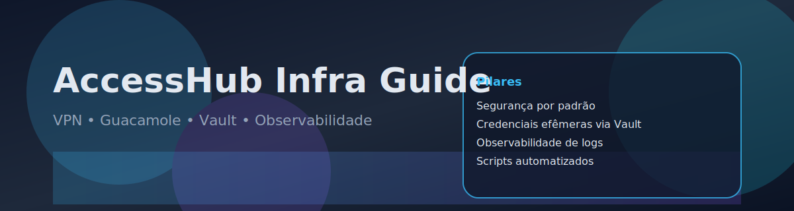
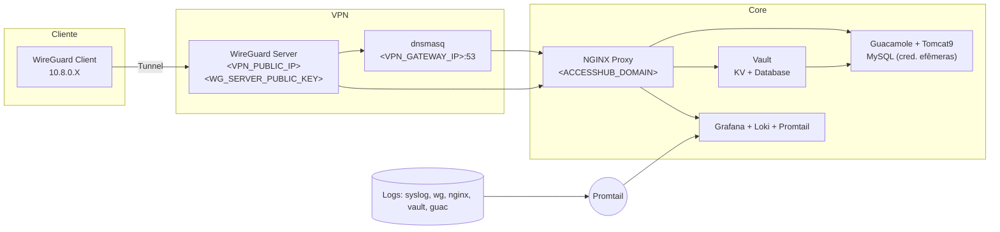

# AccessHub Infra Guide (public)

Guia sanitizado para apresentar a arquitetura e os procedimentos de operação do AccessHub (WireGuard, Guacamole, Vault e observabilidade com Grafana/Loki). Nenhum segredo real está neste repositório; tudo que envolve IPs, domínios, chaves ou senhas foi convertido em placeholders.

---




---

## 🌐 GitHub Pages
- Site estático em `docs/` (habilite nas Settings do GitHub: Pages → Build and deployment → Source: Deploy from a branch → Branch: `main` / folder `docs`).
- Visual pronto para portfólio com links diretos para cada guia e checklist.

---

## 🎯 O que é
- **Arquitetura**: visão de rede e fluxo de credenciais efêmeras via Vault.
- **Operação**: guias passo a passo para VPN, Guacamole, Vault, observabilidade e incidentes.
- **Qualidade**: plano de testes completo para homologação end-to-end.

---

## 📂 Conteúdo rápido
- `docs_cliente/00_arquitetura.md` — panorama da solução.
- `docs_cliente/01_acesso_vpn.md` — uso do WireGuard (cliente/servidor).
- `docs_cliente/02_acesso_guacamole.md` — acesso e operação do Guacamole.
- `docs_cliente/03_operacao_vault.md` — uso do Vault (UI/CLI, engines, AppRole).
- `docs_cliente/04_logs_auditoria.md` — observabilidade com Grafana + Loki/Promtail.
- `docs_cliente/05_procedimentos_emergencia.md` — runbook de incidentes.
- `TESTES.md` — plano de homologação e checklist de evidências.

---

## 🚀 Como usar este pacote
1) **Substitua os placeholders** antes de entregar:
   - `<ACCESSHUB_DOMAIN>` → domínio público (ex.: `accesshub.suaempresa.com`).
   - `<VPN_PUBLIC_IP>` → IP/porta pública do WireGuard (ex.: `203.0.113.10:51820`).
   - `<VPN_GATEWAY_IP>` → gateway interno (ex.: `10.8.0.1`).
   - `<WG_SERVER_PUBLIC_KEY>` → chave pública do servidor WireGuard.
2) **Ajuste credenciais padrão** (ex.: `admin`) conforme a política da sua org.
3) **Gere perfis/chaves novas** para cada ambiente; não reutilize exemplos.
4) **Revisite ranges e portas** para refletir sua topologia e firewall.

---

## 🔒 Escopo e segurança
- Nada de segredos: diretórios sensíveis (`clientes/`, `vault/`, chaves, configs reais) ficaram fora do repositório.
- Binaries não foram incluídos para manter leve; baixe das releases oficiais.

---

## 🧭 Estrutura
```
accesshub-infra-guide/
├─ README.md            # você está aqui
├─ TESTES.md            # plano de homologação
├─ assets/
│  └─ banner.svg        # banner para o README
└─ docs_cliente/        # guias temáticos
   ├─ 00_arquitetura.md
   ├─ 01_acesso_vpn.md
   ├─ 02_acesso_guacamole.md
   ├─ 03_operacao_vault.md
   ├─ 04_logs_auditoria.md
   └─ 05_procedimentos_emergencia.md
```

---

## 🗺️ Arquitetura (mermaid)


---

## ✅ Checklist antes de publicar
- [ ] Todos os placeholders substituídos pelos valores reais.
- [ ] Senhas/keys geradas novamente (nada de exemplos em produção).
- [ ] Ranges de rede e portas revisados.
- [ ] Política de credenciais definida (alterar senhas padrão na 1ª execução).

---

## 📄 Licença
Uso interno do cliente. Ajuste conforme a política da sua organização.
